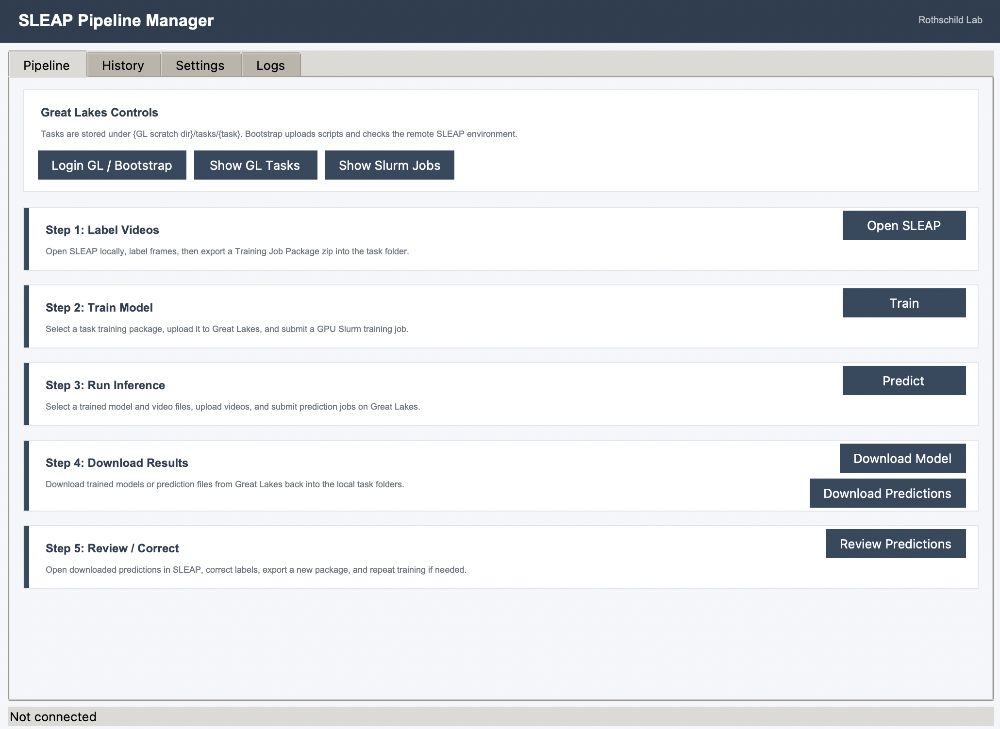
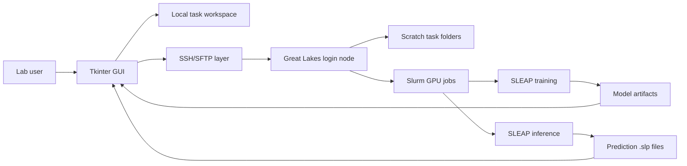

# SLEAP Pipeline Manager

A desktop workflow manager for running SLEAP pose-estimation projects across a local labeling workstation and the University of Michigan Great Lakes HPC cluster.

Built for the Rothschild Lab to make a GPU-backed SLEAP workflow usable by lab members without requiring them to manually write SSH, SFTP, Slurm, or environment setup commands.




## What It Does

SLEAP Pipeline Manager wraps the full labeling, training, inference, and review loop in a guided desktop interface:

1. Label videos locally in SLEAP.
2. Export a SLEAP training job package.
3. Upload training data to Great Lakes.
4. Submit GPU Slurm jobs for model training.
5. Download trained models.
6. Upload videos and submit inference jobs.
7. Download `.slp` prediction files.
8. Re-open predictions for review/correction in SLEAP.

The app keeps local and remote task folders aligned, tracks submitted jobs in local history, and prompts users through SSH password/Duo authentication when Great Lakes requires interactive input.

## Highlights

- **Guided lab workflow:** Step-card GUI for labeling, training, prediction, downloading, and review.
- **Great Lakes integration:** Uploads scripts/configs, bootstraps the remote environment, and submits Slurm jobs.
- **Interactive SSH auth:** Detects password, Duo, passcode, host-key, and verification prompts and surfaces them as GUI dialogs.
- **SSH connection reuse:** Uses OpenSSH ControlMaster to reduce repeated password/Duo prompts during one workflow session.
- **Task-based organization:** Mirrors `tasks/{task}` locally and under Great Lakes scratch.
- **Model and prediction pickers:** Uses history and local files to provide dropdown selections instead of relying on users to remember run names.
- **Configurable inference presets:** Reads predict configs from `gl_sync/inference/`, so new inference profiles can be added without changing GUI code.
- **Remote environment safeguards:** Installs the Great Lakes SLEAP environment under scratch and pins PyTorch CUDA wheels compatible with V100 GPUs.
- **Portable launchers:** Includes macOS/Linux and Windows launch scripts plus a Windows PyInstaller build script.

## Architecture



## Repository Layout

```text
.
  README.md
  run_gui.sh
  run_gui.ps1
  build_windows_exe.ps1
  docs/
    gui_pipeline.png
  gl_sync/
    sleap_pipeline_gui.py     # Desktop GUI
    pipeline_lib.py           # Config, SSH/SFTP, history, task helpers
    install.sh                # Great Lakes remote environment bootstrap
    train.sh                  # Slurm training submission
    predict.sh                # Slurm prediction submission
    sleap_common.sh           # Shared remote shell helpers
    install_local_gui.sh      # macOS/Linux local SLEAP GUI env installer
    install_local_gui.ps1     # Windows local SLEAP GUI env installer
    inference/                # Predict config profiles
```

Runtime data is intentionally not committed:

```text
tasks/
pipeline.log.json
~/sleap_gui_env
Great Lakes scratch task data
```

## Quick Start

Clone the repository and install the local SLEAP GUI environment.

macOS/Linux:

```bash
git clone https://github.com/DDFsco/Great-Lakes.git
cd Great-Lakes
bash gl_sync/install_local_gui.sh
./run_gui.sh
```

Windows PowerShell:

```powershell
git clone https://github.com/DDFsco/Great-Lakes.git
cd Great-Lakes
powershell -ExecutionPolicy Bypass -File gl_sync/install_local_gui.ps1
powershell -ExecutionPolicy Bypass -File run_gui.ps1
```

The launcher first uses `~/sleap_gui_env` if it exists. Otherwise it searches for Python 3.11+ on `PATH`.

## Windows EXE

To build a double-clickable Windows app, run this on a Windows machine:

```powershell
powershell -ExecutionPolicy Bypass -File build_windows_exe.ps1
```

The executable is created at:

```text
dist\SLEAP-Pipeline-Manager.exe
```

The exe bundles the pipeline GUI and `gl_sync` scripts. It does not bundle the full SLEAP deep-learning environment; install that separately with `gl_sync/install_local_gui.ps1`.

## Great Lakes Setup

Open the GUI and configure:

- Great Lakes uniqname
- Slurm account
- Great Lakes scratch directory, optional
- Local project directory
- SLEAP command, optional

If the scratch path is left blank, the GUI defaults to:

```text
/scratch/gid_root/gid0/{uniqname}/sleap_rat
```

Click `Login GL / Bootstrap` to:

- confirm SSH access,
- upload `gl_sync/` scripts to `~/gl_sync`,
- create the remote task root,
- install/check the remote SLEAP environment,
- reuse the SSH session for follow-up commands.

## Local and Remote Task Layout

Each experiment is a task:

```text
tasks/{task_name}/
  labels/
  training_package/
  models/
  videos/
  exports/
```

The same task name is mirrored on Great Lakes:

```text
{GL scratch dir}/tasks/{task_name}/
```

## Inference Configs

Prediction profiles are shell config files under:

```text
gl_sync/inference/
```

Existing profiles:

- `default`
- `aggressive`
- `sensitive`

To add a new profile, add a file such as:

```text
gl_sync/inference/high_recall.conf
```

Then restart the GUI and run `Login GL / Bootstrap` so the config is uploaded to Great Lakes. The dropdown will show `high_recall`.

## Engineering Notes

- Python 3.11+ desktop app built with Tkinter.
- SLEAP local GUI environment is separate from the Great Lakes training environment.
- Great Lakes remote environment installs under scratch, not home, to avoid quota and permission issues.
- Remote PyTorch is pinned to CUDA 12.1 wheels to support Great Lakes V100 GPUs.
- SSH/SFTP calls stream output into the GUI log and support interactive authentication prompts.
- Slurm jobs write logs under each remote task folder.
- Large generated data, videos, models, logs, and predictions are excluded from Git.

## Portfolio Context

This project demonstrates:

- scientific workflow product design,
- desktop GUI engineering,
- HPC/Slurm automation,
- remote environment bootstrapping,
- robust SSH authentication handling,
- cross-platform launch/build tooling,
- practical UX around long-running ML jobs and artifact management.

## Current Limitations

- Slurm job completion is visible through `Show Slurm Jobs`, but the GUI does not yet continuously poll and update job status.
- Windows `.exe` builds should be produced on Windows.
- Great Lakes account, Slurm allocation, and Duo setup are required for remote training/prediction.

## Roadmap

- Add automatic Slurm job polling and state updates in History.
- Add remote log viewer for failed jobs.
- Add richer validation for training package contents.
- Add packaged releases for Windows users.
- Add optional container-based Great Lakes runtime.
